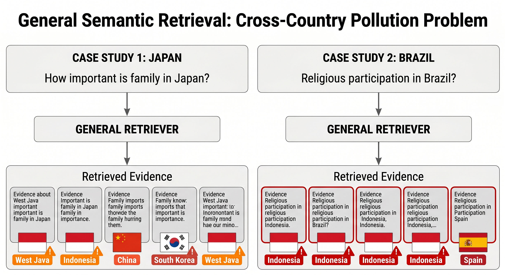
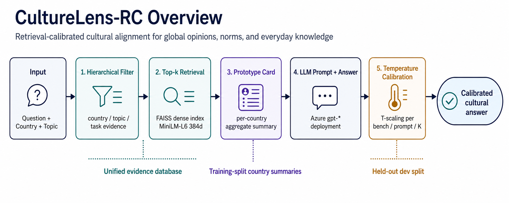

# CultureLens-RC

<p align="center">
  <a href="LICENSE"></a>
  <a href="requirements.txt"></a>
</p>

**Retrieval-Calibrated Cultural Alignment across Global Opinions, Social Norms, and Everyday Knowledge**

CultureLens-RC is an **inference-only** framework that aligns large language models with cultural variation by composing three orthogonal modules: (1) hierarchical country/topic/task **filtering** over a unified evidence database, (2) per-country **prototype** summaries built from training-split evidence, and (3) temperature **calibration** fit on a held-out dev split.

We evaluate on four heterogeneous benchmarks: WorldValuesBench, GlobalOpinionQA, NormAd-Eti, and BLEnD, covering survey distributions, social-norm judgments, and everyday cultural knowledge.

## At A Glance

| Artifact review question | Entry point |
| --- | --- |
| Research question | How can retrieval calibrate cultural alignment across opinions, norms, and everyday knowledge? |
| Core method | CultureLens-RC combines retrieval evidence with calibrated decision rules across heterogeneous cultural benchmarks. |
| Included artifacts | Environment setup, benchmark evaluation scripts, directory structure, testing, and paper-result reproduction commands. |
| Fast validation | `pytest tests/` |
| Paper-scale reproduction | Run evidence building, calibration, main evaluation, ablations, aggregation, and paper-table scripts. |

## Motivation

<p align="center">
  
</p>

General semantic retrieval can surface evidence from the wrong country or region when questions are semantically similar. CultureLens-RC reduces this cross-country pollution by filtering retrieval through the target country, topic, and task before prompting the model.

## Key Contributions

- Hierarchical evidence filtering for country-aware and topic-aware retrieval.
- Per-country prototype cards built only from training-split evidence.
- Temperature calibration fit on held-out dev data for over-confident argmax tasks.
- Four benchmark families: survey distributions, global opinions, social norms, and everyday cultural knowledge.
- Largest reported gains appear in low-resource cultural contexts: +7.3 pp on GOQA low-resource countries and +16.7 pp on BLEnD-MC low-resource regions.

## Overview

<p align="center">
  
</p>

## Environment Setup

Python 3.11+ is recommended.

```bash
git clone git@github.com:Hik289/culture_alignment.git
cd culture_alignment

python -m venv .venv
source .venv/bin/activate
pip install -r requirements.txt
```

Set up model API credentials:

```bash
cp .env.example .env
$EDITOR .env
```

Required variables:

- `LLM_API_KEY`: model API key.
- `LLM_BASE_URL`: compatible model endpoint URL.
- `LLM_MODEL`: model or deployment name.

Never commit `.env` or local credential files.

## Quick Start

1. Download benchmark data.
   See [data/README.md](data/README.md) for WorldValuesBench, GlobalOpinionQA, NormAd, and BLEnD download instructions.

2. Build the evidence database and country prototypes from train splits.

   ```bash
   python data/scripts/build_evidence_and_prototypes.py
   ```

3. Build the FAISS retrieval index.

   ```bash
   python scripts/build_evidence_embeddings.py \
     --evidence data/evidence/evidence.jsonl \
     --out-dir /tmp/culturelens_rc/embeddings \
     --embedder sentence_transformers
   ```

4. Fit temperature calibration on dev splits.

   ```bash
   python -m scripts.step_2_calibration_fit
   ```

5. Run the main experiment and ablation.

   ```bash
   python -m scripts.step_3_main --main
   python -m scripts.step_4_ablation
   ```

6. Aggregate and tabulate.

   ```bash
   python -m scripts.step_5_aggregate
   python scripts/step_6_paper_tables.py
   ```

## Repository Structure

```text
.
|-- README.md
|-- LICENSE
|-- .env.example
|-- requirements.txt
|-- figures/
|   |-- fig_intuition_cross_country_pollution.png
|   `-- culturelens_rc_overview.png
|-- src/                            # Core library
|   |-- model_client.py             # General model API client
|   |-- metrics.py                  # W1, JS-D, KL, TV, Acc, F1, EM, NLL, Brier, ECE
|   |-- prompts.py                  # Task templates and baselines
|   |-- retrieval.py                # General and hierarchical retrievers
|   |-- prototypes.py               # Prototype cards and warning enforcement
|   |-- calibrate.py                # Temperature scaling
|   |-- leakage_check.py            # Test/probe leakage detector
|   |-- io.py                       # Unified parquet loader
|   |-- build_retrieval_index.py    # FAISS IndexFlatIP construction
|   |-- run_predictions.py          # Main run driver
|   `-- aggregate_results.py        # Bootstrap CI and aggregation
|-- scripts/                        # End-to-end pipeline scripts
|-- data/scripts/                   # Data preparation
|-- tests/                          # Offline unit tests
`-- experiments/
    `-- REPRODUCIBILITY.md          # Full reproducibility guide
```

## Reproducing Paper Results

See [experiments/REPRODUCIBILITY.md](experiments/REPRODUCIBILITY.md) for exact commands, dependency versions, random seeds, hardware specs, expected wall time and cost, and known caveats.

## Testing

Run the offline test suite with no LLM calls:

```bash
pytest tests/
```

The tests cover metrics, prompts, retrieval, prototypes, calibration, and aggregation.

## Artifact Notes

Reproduction notes are in [docs/ARTIFACT.md](docs/ARTIFACT.md): environment files, smoke checks, data boundaries, and paper-scale entry points.

## Reproducibility Notes

- **Release.** Source code, configuration files, and runnable entry points are tracked here.
- **Runs.** Start with the smoke or quick-start commands before full grids; record commit hash, Python version, model/backend identifiers, seeds, and command-line arguments.
- **Data.** Large datasets, benchmark downloads, generated outputs, and API keys are not tracked. Use the data/configuration notes above to recreate or point to local copies.
- **Reporting.** Keep raw run folders fixed for paper-scale runs and regenerate tables or figures from logged artifacts with the listed scripts.

## Citation

```bibtex
@inproceedings{culturelens_rc_2026,
  title     = {CultureLens-RC: Retrieval-Calibrated Cultural Alignment across
               Global Opinions, Social Norms, and Everyday Knowledge},
  author    = {Anonymous},
  booktitle = {Proceedings of the Annual Meeting of the Association for
               Computational Linguistics (ACL)},
  year      = {2026},
}
```

## License

MIT License. See [LICENSE](LICENSE).

## Acknowledgements

Built on top of WorldValuesBench (Zeng et al., 2024), GlobalOpinionQA (Durmus et al., 2023), NormAd (Rao et al., 2024), BLEnD (Myung et al., 2024), sentence-transformers (Reimers and Gurevych, 2019), FAISS (Johnson et al., 2019), and model-client SDKs.
